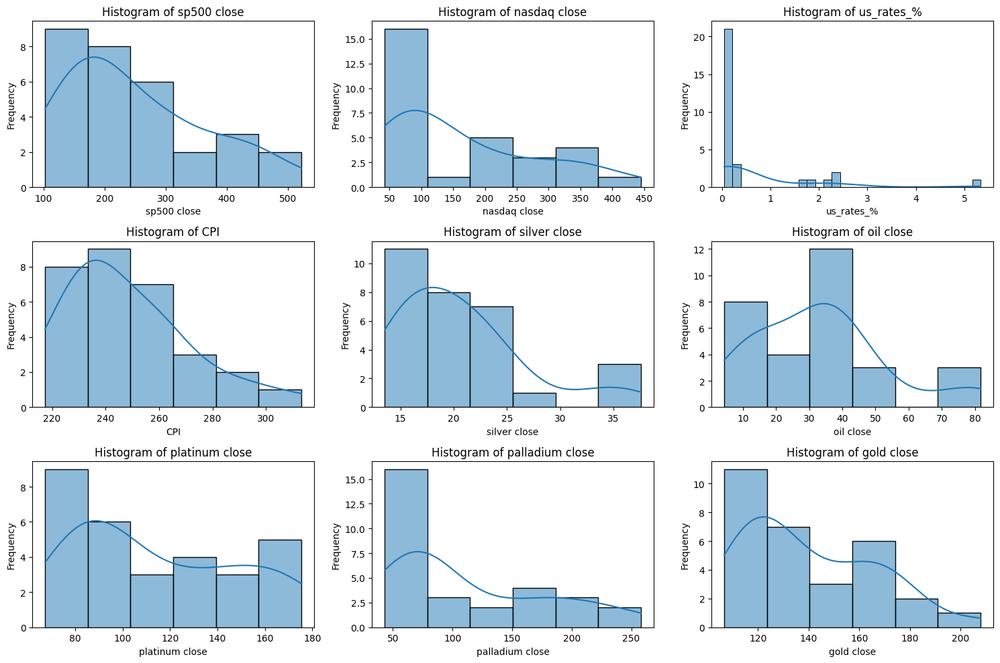
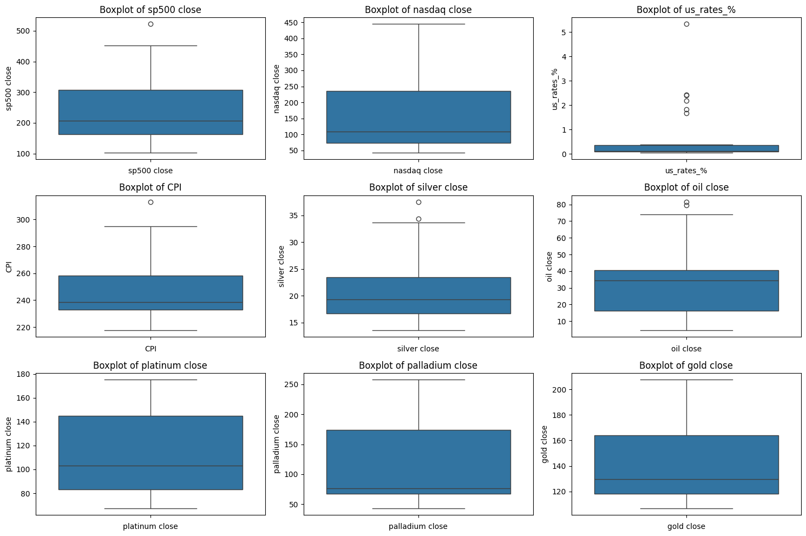
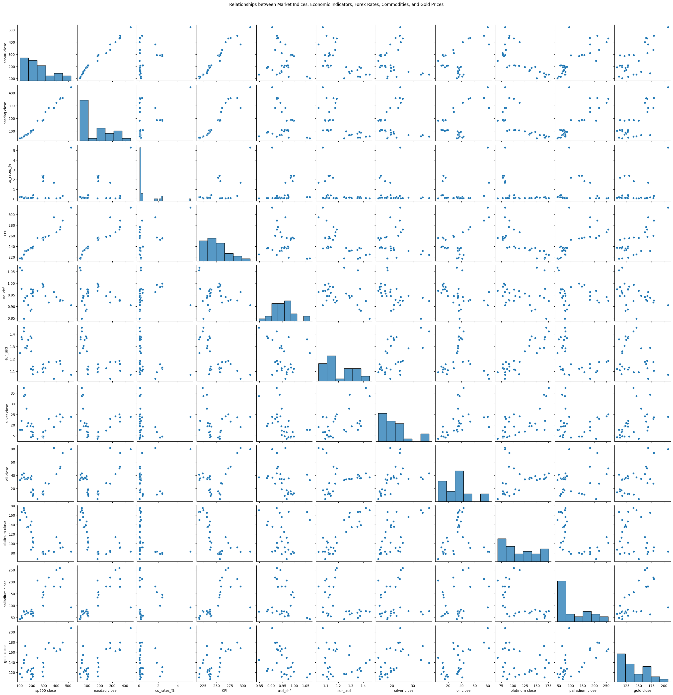
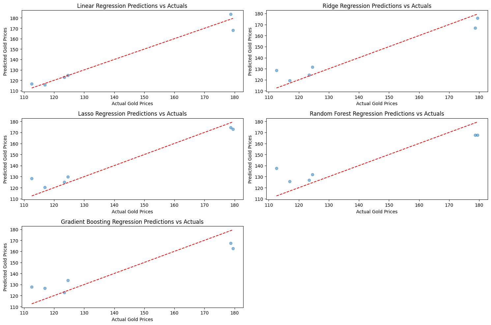

# **Capstone Project 24.1: Final Report on Gold Price Prediction**

# **Project Overview**
Gold has long been regarded as a reliable means of preserving wealth over extended periods, particularly during times of inflation, currency devaluation, or economic turmoil. Its finite supply and inherent value render it less vulnerable to the volatility affecting fiat currencies and other assets. Gold is perceived as a safeguard against uncertainties, offering stability when conventional assets such as stocks and bonds are underperforming or facing risks. Central banks maintain substantial gold reserves within their foreign exchange holdings, underscoring the metal's enduring significance in the global financial landscape.

# **Problem Statement:**
The goal is to forecast the closing price of gold based on multiple economic parameters. This involves analyzing a time series dataset with financial information for market indices, commodities, economic indicators, and forex rates. Market indices and commodities are represented via their respective exchange-traded funds (ETFs). The dataset includes values from 2010 to 2024.

# **Expected Outcome:**
The models should provide accurate forecasts of the closing price of gold, helping investors and policymakers make informed decisions based on economic parameters.

# **Source of Data:**
Yahoo Finance, Kitco, Kaggle. I ended up using a dataset from Kaggle as it contains historical gold prices, financial information for some market indices, commodities, economic indicators, and forex rates. This dataset is suitable for my gold price analysis. Source dataset is available Kaggle link [Gold Price Regression](www.kaggle.com/datasets/franciscogcc/financial-data/data).

# **Key Features**
**Market Indices:**

* S&P 500: Includes opening, closing, high, low prices, and volume.
* NASDAQ:Includes opening, closing, high, low prices, and volume.

# **Economic Indicators:**

* Interest Rates (us_rates_%): Reflects the prevailing interest rates.
* Consumer Price Index (CPI): Measures inflation.

# **Forex Rates:**

* USD/CHF: Exchange rate between US Dollar and Swiss Franc.
* EUR/USD: Exchange rate between Euro and US Dollar.

# **Commodities:**

* Silver: Includes opening, closing, high, low prices, and volume.
* Oil: Includes opening, closing, high, low prices, and volume.
* Platinum: Includes opening, closing, high, low prices, and volume.
* Palladium: Includes opening, closing, high, low prices, and volume.

# **Gold Prices:**
* Gold: Includes opening, closing, high, low prices, and volume.


```python
import pandas as pd
import matplotlib.pyplot as plt
import seaborn as sns
from sklearn.model_selection import train_test_split , GridSearchCV, cross_val_score
from sklearn.linear_model import LinearRegression, Ridge, Lasso
from sklearn.ensemble import RandomForestRegressor, GradientBoostingRegressor
from sklearn.metrics import mean_squared_error, r2_score
from sklearn.preprocessing import StandardScaler

```

Read data set


```python
# Load the dataset
file_path = 'financial_regression.csv'

#create Dataframe
data = pd.read_csv(file_path)


```


```python
#Preview Head
data.head()

```


<div>
<style scoped>
    .dataframe tbody tr th:only-of-type {
        vertical-align: middle;
    }

    .dataframe tbody tr th {
        vertical-align: top;
    }

    .dataframe thead th {
        text-align: right;
    }
</style>
<table border="1" class="dataframe">
  <thead>
    <tr style="text-align: right;">
      <th></th>
      <th>date</th>
      <th>sp500 open</th>
      <th>sp500 high</th>
      <th>sp500 low</th>
      <th>sp500 close</th>
      <th>sp500 volume</th>
      <th>sp500 high-low</th>
      <th>nasdaq open</th>
      <th>nasdaq high</th>
      <th>nasdaq low</th>
      <th>...</th>
      <th>palladium high</th>
      <th>palladium low</th>
      <th>palladium close</th>
      <th>palladium volume</th>
      <th>palladium high-low</th>
      <th>gold open</th>
      <th>gold high</th>
      <th>gold low</th>
      <th>gold close</th>
      <th>gold volume</th>
    </tr>
  </thead>
  <tbody>
    <tr>
      <th>0</th>
      <td>2010-01-14</td>
      <td>114.49</td>
      <td>115.14</td>
      <td>114.42</td>
      <td>114.93</td>
      <td>115646960.0</td>
      <td>0.72</td>
      <td>46.26</td>
      <td>46.520</td>
      <td>46.22</td>
      <td>...</td>
      <td>45.02</td>
      <td>43.86</td>
      <td>44.84</td>
      <td>364528.0</td>
      <td>1.16</td>
      <td>111.51</td>
      <td>112.37</td>
      <td>110.79</td>
      <td>112.03</td>
      <td>18305238.0</td>
    </tr>
    <tr>
      <th>1</th>
      <td>2010-01-15</td>
      <td>114.73</td>
      <td>114.84</td>
      <td>113.20</td>
      <td>113.64</td>
      <td>212252769.0</td>
      <td>1.64</td>
      <td>46.46</td>
      <td>46.550</td>
      <td>45.65</td>
      <td>...</td>
      <td>45.76</td>
      <td>44.40</td>
      <td>45.76</td>
      <td>442210.0</td>
      <td>1.36</td>
      <td>111.35</td>
      <td>112.01</td>
      <td>110.38</td>
      <td>110.86</td>
      <td>18000724.0</td>
    </tr>
    <tr>
      <th>2</th>
      <td>2010-01-18</td>
      <td>NaN</td>
      <td>NaN</td>
      <td>NaN</td>
      <td>NaN</td>
      <td>NaN</td>
      <td>NaN</td>
      <td>NaN</td>
      <td>NaN</td>
      <td>NaN</td>
      <td>...</td>
      <td>NaN</td>
      <td>NaN</td>
      <td>NaN</td>
      <td>NaN</td>
      <td>NaN</td>
      <td>NaN</td>
      <td>NaN</td>
      <td>NaN</td>
      <td>NaN</td>
      <td>NaN</td>
    </tr>
    <tr>
      <th>3</th>
      <td>2010-01-19</td>
      <td>113.62</td>
      <td>115.13</td>
      <td>113.59</td>
      <td>115.06</td>
      <td>138671890.0</td>
      <td>1.54</td>
      <td>45.96</td>
      <td>46.640</td>
      <td>45.95</td>
      <td>...</td>
      <td>47.08</td>
      <td>45.70</td>
      <td>46.94</td>
      <td>629150.0</td>
      <td>1.38</td>
      <td>110.95</td>
      <td>111.75</td>
      <td>110.83</td>
      <td>111.52</td>
      <td>10467927.0</td>
    </tr>
    <tr>
      <th>4</th>
      <td>2010-01-20</td>
      <td>114.28</td>
      <td>114.45</td>
      <td>112.98</td>
      <td>113.89</td>
      <td>216330645.0</td>
      <td>1.47</td>
      <td>46.27</td>
      <td>46.604</td>
      <td>45.43</td>
      <td>...</td>
      <td>47.31</td>
      <td>45.17</td>
      <td>47.05</td>
      <td>643198.0</td>
      <td>2.14</td>
      <td>109.97</td>
      <td>110.05</td>
      <td>108.46</td>
      <td>108.94</td>
      <td>17534231.0</td>
    </tr>
  </tbody>
</table>
<p>5 rows × 47 columns</p>
</div>


```python
# Check data types
print(data.dtypes)
```

    date                   object
    sp500 open            float64
    sp500 high            float64
    sp500 low             float64
    sp500 close           float64
    sp500 volume          float64
    sp500 high-low        float64
    nasdaq open           float64
    nasdaq high           float64
    nasdaq low            float64
    nasdaq close          float64
    nasdaq volume         float64
    nasdaq high-low       float64
    us_rates_%            float64
    CPI                   float64
    usd_chf               float64
    eur_usd               float64
    GDP                   float64
    silver open           float64
    silver high           float64
    silver low            float64
    silver close          float64
    silver volume         float64
    silver high-low       float64
    oil open              float64
    oil high              float64
    oil low               float64
    oil close             float64
    oil volume            float64
    oil high-low          float64
    platinum open         float64
    platinum high         float64
    platinum low          float64
    platinum close        float64
    platinum volume       float64
    platinum high-low     float64
    palladium open        float64
    palladium high        float64
    palladium low         float64
    palladium close       float64
    palladium volume      float64
    palladium high-low    float64
    gold open             float64
    gold high             float64
    gold low              float64
    gold close            float64
    gold volume           float64
    dtype: object
    


```python
data.info()
```

    <class 'pandas.core.frame.DataFrame'>
    RangeIndex: 3904 entries, 0 to 3903
    Data columns (total 47 columns):
     #   Column              Non-Null Count  Dtype  
    ---  ------              --------------  -----  
     0   date                3904 non-null   object 
     1   sp500 open          3719 non-null   float64
     2   sp500 high          3719 non-null   float64
     3   sp500 low           3719 non-null   float64
     4   sp500 close         3719 non-null   float64
     5   sp500 volume        3719 non-null   float64
     6   sp500 high-low      3719 non-null   float64
     7   nasdaq open         3719 non-null   float64
     8   nasdaq high         3719 non-null   float64
     9   nasdaq low          3719 non-null   float64
     10  nasdaq close        3719 non-null   float64
     11  nasdaq volume       3719 non-null   float64
     12  nasdaq high-low     3719 non-null   float64
     13  us_rates_%          176 non-null    float64
     14  CPI                 176 non-null    float64
     15  usd_chf             3694 non-null   float64
     16  eur_usd             3694 non-null   float64
     17  GDP                 57 non-null     float64
     18  silver open         3719 non-null   float64
     19  silver high         3719 non-null   float64
     20  silver low          3719 non-null   float64
     21  silver close        3719 non-null   float64
     22  silver volume       3719 non-null   float64
     23  silver high-low     3719 non-null   float64
     24  oil open            3719 non-null   float64
     25  oil high            3719 non-null   float64
     26  oil low             3719 non-null   float64
     27  oil close           3719 non-null   float64
     28  oil volume          3719 non-null   float64
     29  oil high-low        3719 non-null   float64
     30  platinum open       3719 non-null   float64
     31  platinum high       3719 non-null   float64
     32  platinum low        3719 non-null   float64
     33  platinum close      3719 non-null   float64
     34  platinum volume     3719 non-null   float64
     35  platinum high-low   3719 non-null   float64
     36  palladium open      3719 non-null   float64
     37  palladium high      3719 non-null   float64
     38  palladium low       3719 non-null   float64
     39  palladium close     3719 non-null   float64
     40  palladium volume    3719 non-null   float64
     41  palladium high-low  3719 non-null   float64
     42  gold open           3719 non-null   float64
     43  gold high           3719 non-null   float64
     44  gold low            3719 non-null   float64
     45  gold close          3719 non-null   float64
     46  gold volume         3719 non-null   float64
    dtypes: float64(46), object(1)
    memory usage: 1.4+ MB
    

# **Data Preparation**

**Challenges:**

* **Data Granularity:** The dataset contains data at different granularities, including daily, monthly, and trimonthly values. Normalizing these inconsistencies is crucial for accurate forecasting.

* **Handling Missing Values:** The dataset may contain missing values (NaNs) that need to be addressed to ensure the reliability of the model.
Approach:

**Data Cleaning:**

* Normalize the data to ensure consistency in granularity.
* Handle missing values by imputation or removal.

**Feature Selection:**

* Select relevant features such as market indices, commodities, economic indicators, and forex rates.

**Modeling:**

* Implement multiple regression models, including Linear Regression, Ridge Regression, Lasso Regression, Random Forest Regression, and Gradient Boosting Regression.
* Use cross-validation and Grid Search for hyperparameter tuning.

**Evaluation:**

* Evaluate models using Mean Squared Error (MSE) and R-squared (R²) metrics.
Plot predictions vs actual values to visualize model performance.


```python
# Drop rows with missing values
data_cleaned = data.dropna()


# Continuous Variables: Histogram and Boxplot
continuous_vars = ['sp500 close', 'nasdaq close', 'us_rates_%', 'CPI', 'silver close', 'oil close', 'platinum close', 'palladium close', 'gold close']

plt.figure(figsize=(15, 10))
for i, var in enumerate(continuous_vars):
    plt.subplot(3, 3, i+1)
    sns.histplot(data_cleaned[var], kde=True)
    plt.title(f'Histogram of {var}')
    plt.xlabel(var)
    plt.ylabel('Frequency')
plt.tight_layout()
plt.show()

plt.figure(figsize=(15, 10))
for i, var in enumerate(continuous_vars):
    plt.subplot(3, 3, i+1)
    sns.boxplot(data_cleaned[var])
    plt.title(f'Boxplot of {var}')
    plt.xlabel(var)
plt.tight_layout()
plt.show()


# Select features and target variable
features = data_cleaned[['sp500 open', 'sp500 high', 'sp500 low', 'sp500 close', 'sp500 volume', 'sp500 high-low',
                         'nasdaq open', 'nasdaq high', 'nasdaq low', 'nasdaq close', 'nasdaq volume', 'nasdaq high-low',
                         'us_rates_%', 'CPI', 'usd_chf', 'eur_usd', 'GDP', 'silver open', 'silver high', 'silver low',
                         'silver close', 'silver volume', 'silver high-low', 'oil open', 'oil high', 'oil low', 'oil close',
                         'oil volume', 'oil high-low', 'platinum open', 'platinum high', 'platinum low', 'platinum close',
                         'platinum volume', 'platinum high-low', 'palladium open', 'palladium high', 'palladium low',
                         'palladium close', 'palladium volume']]
target = data_cleaned['gold close']
```


    

    


    

    


**Pairplot of Selected Features**
* **Pairplot of selected features to visualize the relationships between them and the gold closing price.**


```python

# Select relevant features for the plot
selected_features = ['sp500 close', 'nasdaq close', 'us_rates_%', 'CPI', 'usd_chf', 'eur_usd',
                     'silver close', 'oil close', 'platinum close', 'palladium close', 'gold close']

# Create a pairplot to show the relationships between Market Indices, Economic Indicators, Forex Rates, Commodities, and Gold Prices
sns.pairplot(data_cleaned[selected_features])
plt.suptitle('Relationships between Market Indices, Economic Indicators, Forex Rates, Commodities, and Gold Prices', y=1.02)
plt.show()

```


    

    


```python

# Standardize the features
scaler = StandardScaler()
features_scaled = scaler.fit_transform(features)


# Split the data into training and testing sets
X_train, X_test, y_train, y_test = train_test_split(features_scaled, target, test_size=0.2, random_state=42)


# Initialize models

# Initialize models
models = {
  "Linear Regression": LinearRegression(),
  "Ridge Regression": Ridge(),
  "Lasso Regression": Lasso(max_iter=100000),
  "Random Forest Regression": RandomForestRegressor(),
  "Gradient Boosting Regression": GradientBoostingRegressor()
}


# Define hyperparameters for Grid Search
param_grids = {
   "Linear Regression": {'fit_intercept': [True, False]},
   "Ridge Regression": {"alpha": [0.1, 1.0, 10.0]},
   "Lasso Regression": {"alpha": [0.01, 0.1, 1.0]},
   "Random Forest Regression": {"n_estimators": [100, 200], "max_depth": [None, 10, 20]},
   "Gradient Boosting Regression": {"n_estimators": [100, 200], "learning_rate": [0.01, 0.1]}
}


```

**Evaluation Metrics Used:**

* **Mean Squared Error (MSE):**
  Measures the average squared difference between the predicted values and the actual values.

* **R-squared (R²):** Represents the proportion of variance in the dependent variable that is explained by the independent variables.

**Rationale for Use of Given Evaluation Metric**

**Mean Squared Error (MSE):**

* **Rationale:** MSE is widely used because it provides a clear measure of the average error magnitude. It penalizes larger errors more heavily, making it sensitive to outliers. This sensitivity helps in identifying models that perform poorly on certain data points. MSE is useful for comparing different models' performance, as lower MSE values indicate better model accuracy.

**R-squared (R²):**
* **Rationale:** R² is useful for understanding how well the model explains the variability in the target variable. It provides a straightforward interpretation of model fit, making it easy to compare different models. R² values range from 0 to 1, with higher values indicating better model fit. An R² value close to 1 means the model explains most of the variability in the target variable, which is particularly useful when the goal is to explain the relationship between features and the target variable.

**Interpretation:**

* **MSE:** Lower MSE values indicate better model performance. Gradient Boosting Regression had the lowest MSE, indicating it made the most accurate predictions.

* **R²:** Higher R² values indicate better model fit. Gradient Boosting Regression had the highest R², indicating it explained the most variance in the gold price.


```python
# Train and evaluate models
results = {}
predictions = {}

for name, model in models.items():
    param_grid = param_grids[name]
    grid_search = GridSearchCV(model, param_grid, cv=5)
    grid_search.fit(X_train, y_train)

    best_model = grid_search.best_estimator_
    y_pred = best_model.predict(X_test)

    mse = mean_squared_error(y_test, y_pred)
    r2 = r2_score(y_test, y_pred)

    results[name] = {
       "Best parameters": grid_search.best_params_,
       "Mean Squared Error": mse,
       "R-squared": r2
     }
    predictions[name] = y_pred


```


```python
# Print results

for name, result in results.items():
    print(f"Model: {name}")
    print(f"Best parameters: {result['Best parameters']}")
    print(f"Mean Squared Error: {result['Mean Squared Error']}")
    print(f"R-squared: {result['R-squared']}")
    print("\n")

```

    Model: Linear Regression
    Best parameters: {'fit_intercept': True}
    Mean Squared Error: 29.190489197863315
    R-squared: 0.9639090364729033
    
    
    Model: Ridge Regression
    Best parameters: {'alpha': 10.0}
    Mean Squared Error: 77.33242208743776
    R-squared: 0.9043866101009346
    
    
    Model: Lasso Regression
    Best parameters: {'alpha': 1.0}
    Mean Squared Error: 58.39627000705779
    R-squared: 0.9277991664799683
    
    
    Model: Random Forest Regression
    Best parameters: {'max_depth': None, 'n_estimators': 200}
    Mean Squared Error: 172.20771748781206
    R-squared: 0.7870833061820652
    
    
    Model: Gradient Boosting Regression
    Best parameters: {'learning_rate': 0.01, 'n_estimators': 200}
    Mean Squared Error: 137.72852648983456
    R-squared: 0.8297131921122707
    
    
    

### Key Parameters Influencing Gold Price

**S&P 500 Close**:

*   **Influence**: Negative
        
*   **Interpretation**: As the S&P 500 index closes higher, the gold price tends to decrease. This suggests that when the stock market performs well, investors may prefer equities over gold.
    

**NASDAQ Close**:

*   **Influence**: Positive
    
    
*   **Interpretation**: As the NASDAQ index closes higher, the gold price tends to increase. This indicates that gold may be seen as a complementary asset to technology stocks.
    

**US Interest Rates (%)**:

*   **Influence**: Negative
    
    
*   **Interpretation**: Higher interest rates lead to a decrease in gold prices. This is because higher interest rates make fixed-income investments more attractive compared to gold, which does not yield interest.
    

**Consumer Price Index (CPI)**:

*   **Influence**: Positive
    
    
*   **Interpretation**: An increase in CPI, which measures inflation, leads to higher gold prices. Gold is often used as a hedge against inflation.
    

**Silver Close**:

*   **Influence**: Positive
    
    
*   **Interpretation**: Higher silver prices are associated with higher gold prices. This suggests that precious metals tend to move in tandem.
    

**Oil Close**:

*   **Influence**: Negative

    
*   **Interpretation**: Higher oil prices lead to a decrease in gold prices. This may be due to the increased cost of production and transportation affecting gold mining operations.
    

**Platinum Close**:

*   **Influence**: Positive
    
    
*   **Interpretation**: Higher platinum prices are associated with higher gold prices. Similar to silver, precious metals tend to move together.
    

**Palladium Close**:

*   **Influence**: Negative
    
    
*   **Interpretation**: Palladium prices have a slight negative influence on gold prices, but the impact is minimal.
    

### Summary

*   **S&P 500 Close**: Negative influence on gold price.
    
*   **NASDAQ Close**: Positive influence on gold price.
    
*   **US Interest Rates (%)**: Negative influence on gold price.
    
*   **Consumer Price Index (CPI)**: Positive influence on gold price.
    
*   **Silver Close**: Positive influence on gold price.
    
*   **Oil Close**: Negative influence on gold price.
    
*   **Platinum Close**: Positive influence on gold price.
    
*   **Palladium Close**: Slight negative influence on gold price.


```python

# Plot predictions vs actual values for each model
plt.figure(figsize=(15, 10))
for i, (name, y_pred) in enumerate(predictions.items(), 1):
  plt.subplot(3, 2, i)
  plt.scatter(y_test, y_pred, alpha=0.5)
  plt.plot([y_test.min(), y_test.max()], [y_test.min(), y_test.max()], '--r')
  plt.xlabel('Actual Gold Prices')
  plt.ylabel('Predicted Gold Prices')
  plt.title(f'{name} Predictions vs Actuals')
plt.tight_layout()
plt.show()

```


    

    


**Recommendations**

**Monitor Precious Metal Prices:**

**Silver and Platinum:**
* Since silver and platinum prices have strong positive correlations with gold prices, it is recommended to monitor these precious metals closely. They tend to move in tandem with gold prices.
Keep an Eye on Interest Rates:

**Interest Rates:**
* Higher interest rates lead to a decrease in gold prices. This is because higher interest rates make fixed-income investments more attractive compared to gold, which does not yield interest.

**Consider the Impact of Oil Prices:**

**Oil Prices:**
* Oil prices show moderate positive correlations with gold prices. During periods of economic uncertainty, consider the influence of oil prices on gold prices.

**Consumer Price Index (CPI):**
* An increase in CPI, which measures inflation, leads to higher gold prices. Gold is often used as a hedge against inflation.

**Stock Market Indicators:**
* Stock Market: As the S&P 500 index closes higher, the gold price tends to decrease. This suggests that when the stock market performs well, investors may prefer equities over gold.

### Instructions
<pre>
- Clone the GitHub repository
- Please run the notebooks in sequence

├── data
│    ├── financial_regression.csv
├── Code
|    ├── Gold_Price.ipynb
├── presentation
|   ├── README.md

</pre>

## Data Preparation and Visulalization
<pre>
Code Used: Python
Packages:
pandas: Data manipulation and analysis.
matplotlib: Data visualization.
seaborn: Statistical data visualization.
scikit-learn: Machine learning algorithms and evaluation metrics.
</pre>

## Contact and Further Information

Sanjay Pal Singh

Email: ssanjay08@gmail.com

